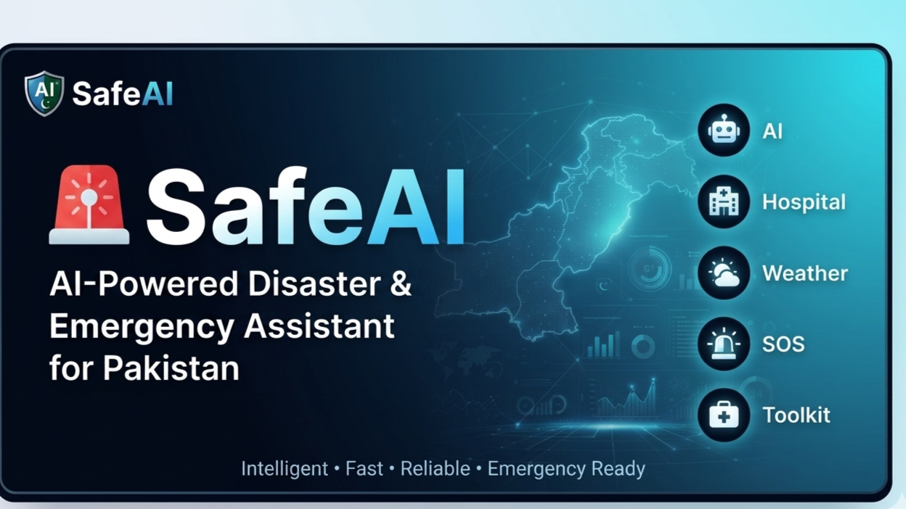
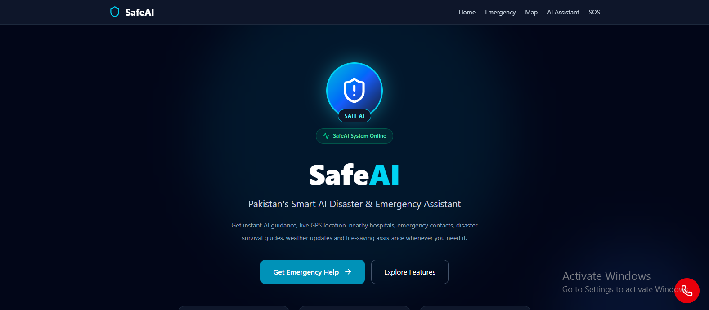
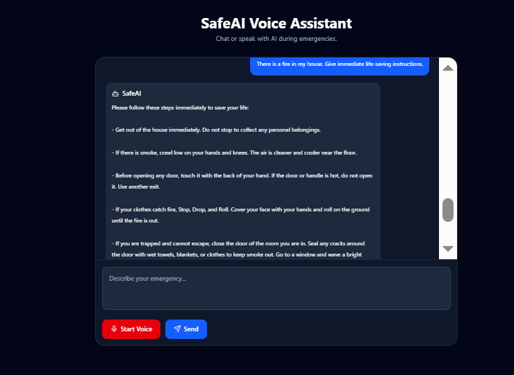
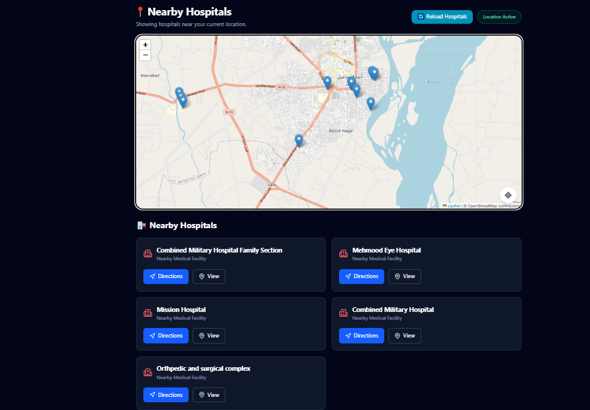
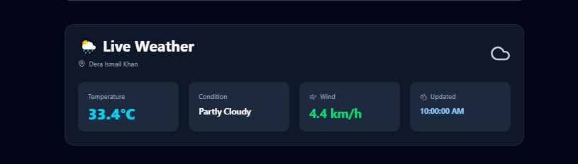
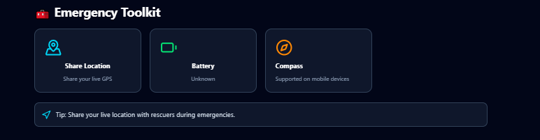
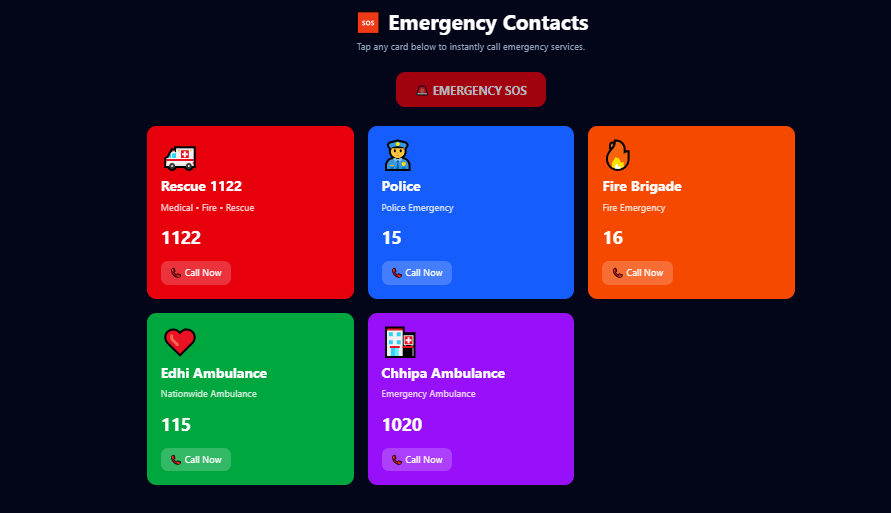
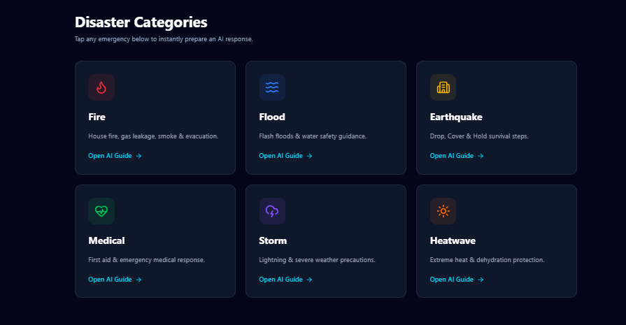

<p align="center">
  
</p>

<h1 align="center">
🚨 SafeAI
</h1>

<h3 align="center">
AI-Powered Disaster & Emergency Assistant for Pakistan
</h3>

<p align="center">
An intelligent emergency response platform that combines Artificial Intelligence, live weather updates, nearby hospitals, emergency guides and essential safety tools into one modern web application.
</p>

<p align="center">

[](https://safeai-pakistan.vercel.app)
[](https://github.com/Safeai-pakistan/Safeai-pakistan)
[](https://react.dev)
[](https://www.typescriptlang.org)
[](https://ai.google.dev)
[](https://vercel.com)

</p>

**SafeAI** is an AI-powered disaster and emergency assistance web application developed to help people respond quickly, safely, and confidently during emergency situations. Instead of searching multiple websites or applications for emergency information, SafeAI combines Artificial Intelligence, live weather updates, nearby hospitals, emergency contacts, disaster preparedness guides, and emergency tools into one easy-to-use platform.

The application has been designed as an original final project with the objective of solving a real-world problem faced by people during emergencies, especially in Pakistan where natural disasters, road accidents, fires, heatwaves, floods, and medical emergencies occur regularly.

🌐 **Live Website:** https://safeai-pakistan.vercel.app/

📂 **GitHub Repository:** https://github.com/Safeai-pakistan/Safeai-pakistan

---

# 🌍 Project Overview

During emergency situations, every second matters. Unfortunately, people often panic and waste valuable time searching for emergency phone numbers, hospital locations, weather updates, or basic first-aid instructions. Information is usually scattered across multiple websites and applications, making it difficult to find reliable guidance when it is needed most.

SafeAI was developed to solve this problem by providing a centralized emergency assistance platform powered by Artificial Intelligence.

The application combines multiple emergency-related services into a single interface where users can quickly access important information, communicate with an AI emergency assistant, locate nearby hospitals, view live weather conditions, and read emergency response guides without switching between different applications.

Unlike a traditional chatbot, SafeAI is specifically designed for emergency situations. Every feature has been developed with the goal of improving public safety and helping users make informed decisions during critical moments.

---

# 🎯 Project Mission

The mission of SafeAI is to make emergency assistance simple, intelligent, and accessible for everyone.

The project aims to reduce panic during disasters by providing reliable emergency information through a modern AI-powered web application.

SafeAI focuses on helping users by:

- Providing AI-powered emergency guidance.
- Helping users locate nearby hospitals.
- Displaying live weather conditions.
- Offering quick access to emergency contacts.
- Providing disaster-specific emergency guides.
- Supplying useful emergency toolkit features such as GPS location sharing, battery information, and compass support.

Rather than replacing emergency services, SafeAI acts as a digital assistant that helps users make faster and safer decisions while encouraging them to contact official emergency responders whenever necessary.

---

# ❗ Problem Statement

Pakistan regularly experiences natural disasters and emergency situations including floods, earthquakes, fires, road accidents, extreme weather conditions, and medical emergencies.

During these situations, many people experience confusion because they:

- Do not know what actions should be taken first.
- Cannot quickly locate nearby hospitals.
- Waste valuable time searching emergency numbers.
- Lack reliable disaster preparedness information.
- Become overwhelmed by information available across different platforms.
- Need immediate guidance before professional emergency responders arrive.

Most existing applications only solve one part of this problem. Some provide weather updates, some provide maps, while others provide AI conversations. Very few applications combine all essential emergency services into one platform.

This fragmentation increases confusion and slows emergency response.

---

# 💡 Proposed Solution

SafeAI solves this problem by bringing together the most important emergency resources into a single AI-powered platform.

Instead of opening multiple applications during a stressful situation, users can access everything they need from one place.

The application enables users to:

- Ask an AI assistant for emergency guidance.
- Find nearby hospitals using their current location.
- Check live weather conditions.
- Access emergency contact numbers.
- Read emergency response guides.
- Use emergency toolkit utilities such as GPS location sharing, battery status, and compass information.

This integrated approach makes emergency information easier to access while improving the overall user experience during critical situations.

---

# 🚀 Why SafeAI?

SafeAI was created with one simple goal:

> **"To provide fast, intelligent, and reliable emergency assistance through Artificial Intelligence while keeping the user experience simple enough for anyone to use during stressful situations."**

The project demonstrates how Artificial Intelligence can be used responsibly to solve real-world problems instead of simply providing conversational responses.

Every feature inside SafeAI has been designed to improve emergency preparedness and support users when every second counts.

---

# 🚀 Key Features

SafeAI is designed as a complete emergency assistance platform rather than a single-purpose application. Every feature has been carefully integrated to provide users with reliable information and practical tools during emergency situations.

---

## 🤖 AI Emergency Assistant

The AI Emergency Assistant is the core feature of SafeAI. It is powered by **Google Gemini AI** and has been specifically configured to act as an emergency response assistant rather than a general-purpose chatbot.

The assistant helps users by:

- Answering emergency-related questions.
- Providing calm and step-by-step emergency guidance.
- Understanding English, Urdu, and Roman Urdu queries.
- Suggesting appropriate safety precautions.
- Encouraging users to contact official emergency services whenever required.
- Avoiding unsafe or misleading recommendations.

This feature enables users to receive immediate emergency guidance within seconds.

---

## 🏥 Nearby Hospitals

SafeAI helps users locate nearby hospitals using their current GPS location.

The application:

- Requests the user's location permission.
- Detects the current geographical position.
- Displays nearby hospitals on an interactive map.
- Shows hospital markers for easier navigation.
- Lists nearby hospitals for quick reference.

This feature is especially useful during medical emergencies where finding the nearest healthcare facility quickly can save valuable time.

---

## ☀️ Live Weather Monitoring

Weather conditions often play a major role during disasters such as floods, storms, heatwaves, or heavy rainfall.

SafeAI provides live weather information so users can stay informed before making important decisions.

The weather section displays:

- Current temperature
- Weather conditions
- Humidity
- Wind speed
- Real-time weather updates

This helps users prepare for changing environmental conditions during emergencies.

---

## 🚨 Emergency SOS

The SOS section provides users with immediate access to emergency support.

Instead of searching for emergency information manually, users can quickly navigate to emergency resources and contacts from one dedicated section.

The goal of this feature is to reduce response time during critical situations.

---

## ☎️ Emergency Contacts

SafeAI includes important emergency contact numbers commonly used in Pakistan.

Users can quickly access emergency services without searching online.

Examples include:

- Rescue services
- Police
- Ambulance
- Fire Brigade

Keeping these contacts readily available helps users react more efficiently during emergencies.

---

## 📖 Emergency Guides

SafeAI contains disaster-specific emergency preparedness guides designed to educate users before and during emergencies.

The guides provide practical instructions for situations including:

- Earthquakes
- Floods
- Fires
- Medical emergencies

Each guide presents clear and easy-to-follow steps, helping users understand the safest actions to take during different disaster scenarios.

---

## 🧰 Emergency Toolkit

The Emergency Toolkit provides useful utilities that can assist users during emergency situations.

Available tools include:

### 📍 Live Location Sharing

Allows users to quickly share their current GPS location with family members, friends, or emergency responders.

---

### 🔋 Battery Information

Displays the device battery level so users can monitor remaining power during emergencies and manage battery usage more effectively.

---

### 🧭 Compass

Provides compass information (on supported devices) to help users determine their direction while navigating unfamiliar areas.

---

## 📱 Responsive User Interface

SafeAI has been designed using a fully responsive layout that adapts seamlessly across different screen sizes.

The application works smoothly on:

- Desktop computers
- Laptops
- Tablets
- Mobile devices

The responsive design ensures that emergency information remains accessible regardless of the user's device.

---

## ⬆️ Scroll-to-Top Navigation

A floating "Back to Top" button appears after scrolling, allowing users to instantly return to the top of the page with a single click.

This improves navigation and enhances the overall user experience, especially on mobile devices where long scrolling can be inconvenient.

---

## ⚡ Modern User Experience

Special attention has been given to creating a clean, fast, and intuitive interface.

The application includes:

- Smooth scrolling navigation
- Interactive feature cards
- Clean emergency-focused layout
- Modern iconography
- Mobile-friendly design
- Fast page rendering
- Simple and distraction-free interface

The overall design philosophy focuses on providing essential information quickly while maintaining an easy-to-use experience during stressful situations.

---

# 🤖 AI Feature

Artificial Intelligence is the core component of SafeAI.

The AI assistant is intentionally designed for emergency response scenarios instead of acting as a general-purpose chatbot.

Instead of functioning as a general-purpose chatbot, the AI has been specifically designed to assist users during disasters and emergency situations.

The assistant provides practical, reliable, and easy-to-understand emergency guidance while encouraging users to seek professional emergency services whenever necessary.

The AI is capable of helping users during situations such as:

- 🚨 Fires
- 🌊 Floods
- 🌍 Earthquakes
- 🚗 Road Accidents
- 🩺 Medical Emergencies
- 🌡️ Heatwaves
- ⛈️ Severe Weather
- ⚡ General Emergency Preparedness

The assistant understands emergency-related questions and generates step-by-step responses that help users remain calm and make informed decisions.

---

## 🧠 Custom AI System Prompt

The AI assistant follows a custom-written system prompt specifically created for SafeAI.

The prompt instructs the AI to:

- Behave as an emergency response assistant.
- Provide calm and practical guidance.
- Give clear step-by-step instructions.
- Understand English, Urdu and Roman Urdu.
- Encourage users to contact official emergency services whenever appropriate.
- Avoid generating unsafe, misleading or harmful advice.

This prompt transforms the Gemini model into a specialized emergency assistant rather than a general conversational chatbot.

---

# 💻 Technology Stack

SafeAI was developed using modern web technologies that provide performance, scalability and maintainability.

| Category | Technology |
|-----------|------------|
| Frontend Framework | React 19 |
| Programming Language | TypeScript |
| Build Tool | Vite |
| Styling | Tailwind CSS v4 |
| Artificial Intelligence | Google Gemini AI |
| Maps | React Leaflet |
| Map Provider | OpenStreetMap |
| Hospital Data | Overpass API |
| Weather Service | Geoapify Weather API |
| Icons | Lucide React |
| Version Control | Git & GitHub |
| Deployment | Vercel |

---

# 🏗️ Project Architecture

The application follows a modular component-based architecture where every major feature is developed as an independent React component.

```text
                    User

                      │

                      ▼

               React Application

                      │

     ┌────────────────┼────────────────┐

     ▼                ▼                ▼

AI Assistant      Weather API      Maps & Hospitals

     │                │                │

     └────────────────┼────────────────┘

                      ▼

             Emergency Information

                      ▼

                    User
```

This modular structure improves maintainability, scalability and code organization.

---

# 📂 Project Structure

```text
SafeAI
│
├── public
│
├── src
│   │
│   ├── assets
│   │
│   ├── components
│   │     ├── AIChat
│   │     ├── EmergencyCards
│   │     ├── EmergencyGuides
│   │     ├── EmergencyToolkit
│   │     ├── FloatingSOS
│   │     ├── Footer
│   │     ├── Hero
│   │     ├── Map
│   │     ├── Navbar
│   │     ├── QuickActions
│   │     ├── ScrollToTopButton
│   │     ├── SOS
│   │     └── Weather
│   │
│   ├── context
│   │
│   ├── services
│   │
│   ├── App.tsx
│   ├── main.tsx
│   └── index.css
│
├── package.json
├── vite.config.ts
├── tsconfig.json
├── README.md
└── .gitignore

```

---

# 🛠️ Development & Local Installation

Follow the steps below to run the project locally.

### 1️⃣ Install Dependencies

```bash
npm install
```

### 2️⃣ Create Environment Variables

Create a `.env` file in the project root.

```env
VITE_GEMINI_API_KEY=YOUR_GEMINI_API_KEY
VITE_GEOAPIFY_API_KEY=YOUR_GEOAPIFY_API_KEY
```

> **Important:** Never upload your API keys to GitHub.

### 3️⃣ Start Development Server

```bash
npm run dev
```

### 4️⃣ Build Production Version

```bash
npm run build
```

### 5️⃣ Preview Production Build

```bash
npm run preview
```

---

# 🔒 Security Considerations

To protect sensitive information:

- API keys are stored using environment variables.
- No secret credentials are committed to the public GitHub repository.
- Location access is requested only after user permission.
- The AI assistant is instructed not to generate harmful or unsafe emergency advice.

---

# 📸 Application Screenshots

The following screenshots demonstrate the main functionality and user interface of SafeAI.

| Home | AI Assistant |
|------|--------------|
|  |  |

| Hospitals | Weather |
|-----------|---------|
|  |  |

| Emergency Toolkit | |
|------------------|-|
|  | |

| Contacts | Disaster categories |
|-----------|---------|
|  |  |

---

# 🌐 Live Project

### 🚀 Live Website

https://safeai-pakistan.vercel.app/

### 📂 Public GitHub Repository

https://github.com/Safeai-pakistan/Safeai-pakistan

---

# 📋 Project Highlights

✔ Original Project Idea

✔ AI Prompt Engineering

✔ AI-Powered Emergency Assistant

✔ Real-Time Weather Information

✔ Nearby Hospitals using GPS

✔ Interactive Emergency Toolkit

✔ Emergency Contacts

✔ Disaster Preparedness Guides

✔ Responsive Modern User Interface

✔ Public GitHub Repository

✔ Successfully Deployed on Vercel

---

# 🎓 Learning Outcomes

This project helped strengthen practical skills in:

- React.js
- TypeScript
- Tailwind CSS
- Prompt Engineering
- Google Gemini AI Integration
- REST API Integration
- React Component Architecture
- State Management
- Responsive Web Design
- Git & GitHub
- Vercel Deployment
- Problem Solving
- Real-world AI Application Development

---

# 🇵🇰 Future Improvements

Although SafeAI is fully functional, several additional features can further enhance the application in the future.

Possible future improvements include:

- 🚑 Live Ambulance Tracking
- 🩸 Blood Donor Finder
- 📶 Offline Emergency Mode
- 🎙️ Voice-Based AI Assistant
- 📍 Safe Shelter Recommendations
- 🌍 Multi-language Support
- 🔔 Emergency Alert Notifications
- 👨‍⚕️ Doctor Consultation Integration
- 📡 Disaster Alert System

These improvements would make SafeAI even more useful during real emergency situations.

---

# 🎯 Conclusion

SafeAI was developed as an original AI-powered emergency assistance platform to solve a real-world problem faced by people during disasters and emergency situations.

Instead of focusing on a single feature, the application combines Artificial Intelligence, emergency guidance, location services, weather monitoring, emergency contacts, and disaster preparedness resources into one unified platform.

The project demonstrates how modern web technologies and Artificial Intelligence can work together to improve public safety, reduce panic, and help users make informed decisions during critical moments.

Throughout the development process, emphasis was placed on building a complete, responsive, and user-friendly application rather than simply demonstrating individual technologies.

SafeAI reflects practical software engineering principles including modular architecture, reusable React components, responsive interface design, secure API integration, and responsible AI implementation.

This project was completed as an original Final AI Course Project and represents a complete end-to-end web application from idea, design and development to deployment.

---

# 👨‍💻 Developer

**Project Name:** SafeAI – AI-Powered Disaster & Emergency Assistant for Pakistan

Developed as an individual Final AI Course Project.

---

## 🙏 Acknowledgements

This project was made possible with the help of:

- React
- TypeScript
- Tailwind CSS
- Google Gemini AI
- React Leaflet
- OpenStreetMap
- Overpass API
- Geoapify Weather API
- Lucide React
- GitHub
- Vercel

Special thanks to the ACT AI Program for providing the opportunity to design and develop an original AI-powered solution addressing a real-world problem.

---

## ⭐ Thank You

Thank you for reviewing **SafeAI**.

I hope this project demonstrates how Artificial Intelligence can be applied responsibly to create practical solutions that improve emergency preparedness and assist people during critical situations.

---

<div align="center">

### 🚨 SafeAI

AI-Powered Disaster & Emergency Assistant for Pakistan

Developed as an Original Final AI Course Project.

⭐ If you found this project useful, consider giving it a star on GitHub.

</div>